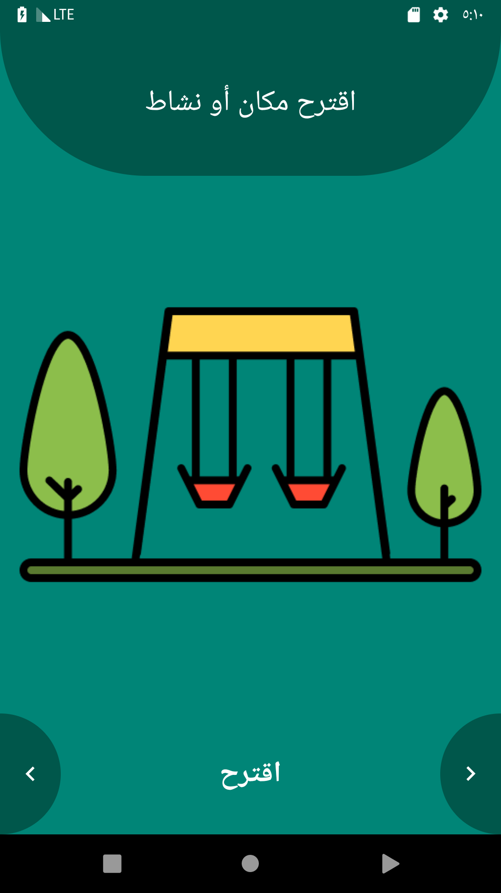
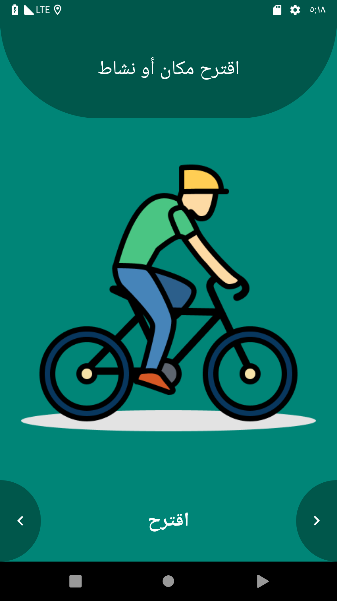

# 
نبذة عن المشروع

في كثير من الأحيان نريد الخروج مع الأصدقاء وإمضاء وقت ممتع ولكن من الصعب الاتفاق على مكان أو نشاط معين وبالتالي يضيع بعض الوقت على تحديد المكان أو النشاط.

في هذا المشروع ستقوم بحل هذه المشكلة عن طريق بناء تطبيق لاقتراح الأماكن و النشاطات وهو تطبيق بسيط يحتوي على مجموعة من الصور المضافة مسبقا ويمكن للمستخدم استعراض الصور والتنقل بينها للأمام وللخلف. ويمكن للتطبيق اقتراح مكان أو نشاط عشوائي.

# 
الهدف من هذا المشروع ؟
 

في الدروس الأخيرة تعلمت كيفية استخدام الجافا لجعل تطبيق اندرويد تفاعلي، في هذا المشروع سوف تتدرب على هذه المهارات مع التركيز على الأوامر البرمجية الخاصة بالأزرار، المتغيرات والتعديل على الViews من خلال الكود.

# 
متطلبات المشروع

يجب أن يحتوي المشروع على المزايا التالية:
<ul>
<li>
مكان لعرض الصورة المكان أو النشاط.
</li>
<li>
مكان لعرض اسم المكان أو النشاط.
</li>
<li>
زر للانتقال للصورة التالية.
</li>
<li>
زر للانتقال للصورة السابقة.
</li>
<li>
زر لاقتراح مكان أو نشاط عشوائيا.
</li>
<li>
استخدام مفهوم الـ Class
</li>
<li>
استخدام مفهوم الـ Array
</li>
<li>
استخدام الدوال لتقسيم الكود
</li>
</ul>

# 
الشاشة الرئيسية

  

  

